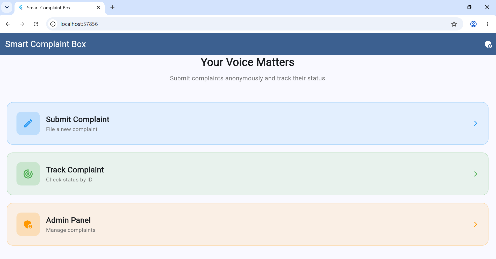
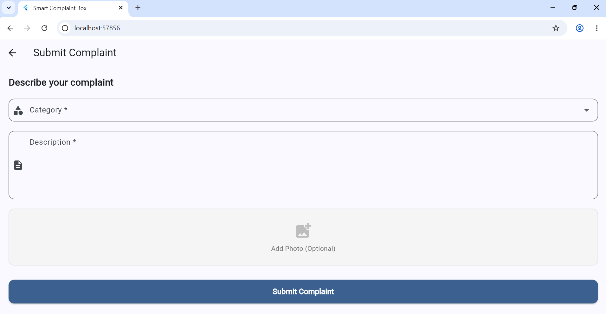
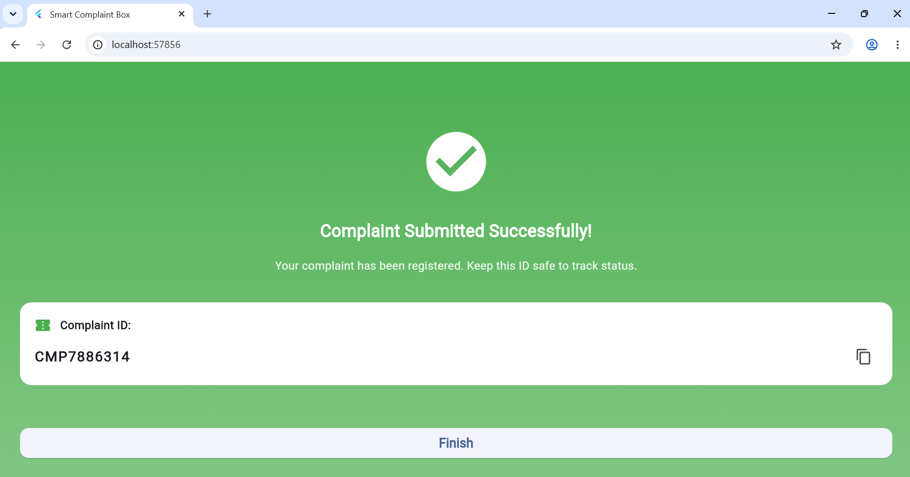
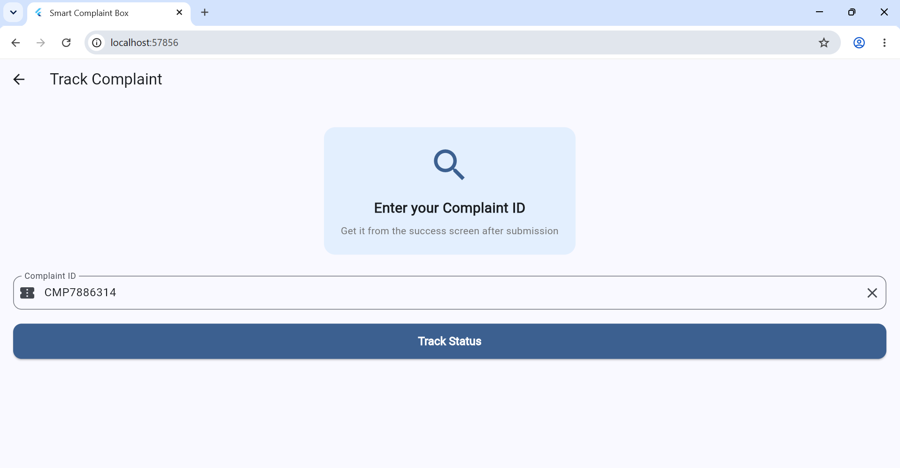
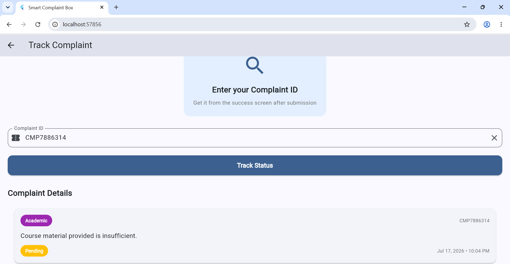
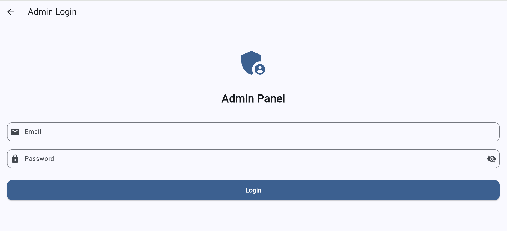
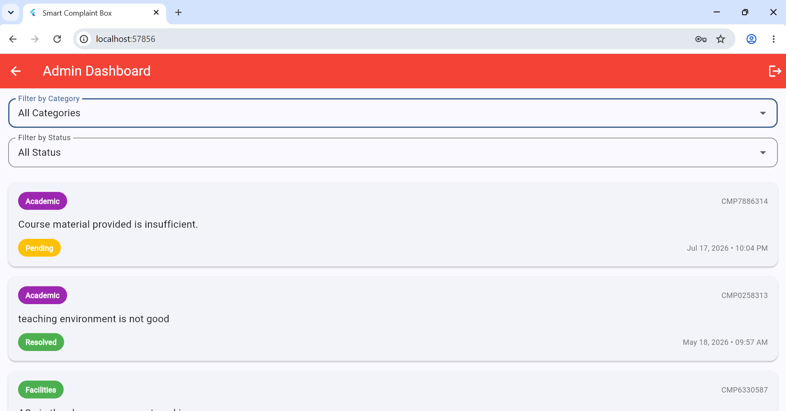

# Smart Complaint Box

A Flutter-based complaint management application that allows users to submit complaints anonymously and track their progress using a unique tracking ID.

The application eliminates the need for user registration, making complaint submission quick, simple, and privacy-friendly.

---

## Features

### 👤 User Features

- Submit complaints anonymously
- No registration or login required
- Select complaint category
- Write detailed complaint description
- Upload an optional image as evidence
- Automatically generate a unique Complaint ID
- Track complaint status using Complaint ID

### 👨‍💼 Admin Features

- View all submitted complaints
- Filter complaints by category
- Filter complaints by status
- View complaint details
- Add resolution messages
- Mark complaints as resolved
- Monitor complaint history

---

## 🛠️ Technologies Used

- Flutter
- Dart
- Firebase Authentication
- Cloud Firestore
- Firebase Storage
- Image Picker

---

# 📸 Application Screenshots

### 1. Home Page



The application's landing page where users can choose to submit a new complaint or track an existing complaint.
---

### 2. Submit Complaint



Users can submit complaints anonymously by selecting a category, providing a description, and optionally attaching an image.
---

### 3. Complaint Submitted Successfully



After submission, the system generates a unique Complaint ID that can be used to track the complaint later.
---

### 4. Track Complaint



Users enter their Complaint ID to check the current status of their complaint.
---

### 5. Complaint Status



Displays the complaint details, current status, and any resolution message provided by the administrator.
---

### 6. Admin Login



Authorized administrators log in to access the complaint management dashboard.
---

### 7. Admin Dashboard



Administrators can view all complaints, apply filters by category or status, and manage complaint records.

---

### 8. Complaint Resolution


Administrators review complaint details, enter a resolution message, and mark complaints as resolved.

---

## 🚀 Getting Started

### Clone the repository

```bash
git clone https://github.com/hanianajam/Smart-Complaint-Box.git
```

### Navigate to the project

```bash
cd Smart-Complaint-Box
```

### Install dependencies

```bash
flutter pub get
```

### Run the application

```bash
flutter run
```

---

## 🎯 How It Works

1. Open the application.
2. Submit a complaint anonymously.
3. Receive a unique Tracking ID.
4. Use the Tracking ID to check the complaint status anytime.
5. The administrator reviews and resolves the complaint.
---

## 🔮 Future Improvements

- Email notifications
- Push notifications
- Complaint analytics dashboard
- Search by Complaint ID
- Complaint priority levels
- Multi-admin support
- Export complaint reports

---

## 👩‍💻 Author

**Hania Najam**

BS Computer Science Student

GitHub: https://github.com/hanianajam

---

## 📄 License

This project is developed for educational purposes.