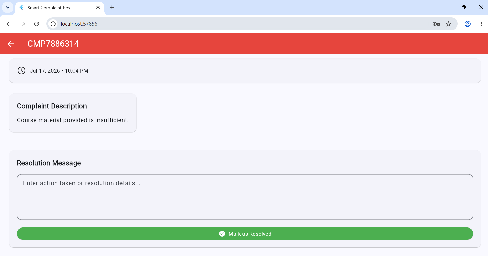

# Smart Complaint Box

A Flutter-based complaint management application that allows users to submit complaints anonymously and track their progress using a unique tracking ID.

The application eliminates the need for user registration, making complaint submission quick, simple, and privacy-friendly. It also includes an administrator dashboard for reviewing, filtering, and resolving complaints.

---

## Features

### 👤 User Features

- Submit complaints anonymously
- No registration or login required
- Select complaint category
- Write detailed complaint description
- Upload an optional image as evidence
- Automatically generate a unique Complaint ID
- Track complaint status using Complaint ID

### 👨‍💼 Admin Features

- View all submitted complaints
- Filter complaints by category
- Filter complaints by status
- View complaint details
- Add resolution messages
- Mark complaints as resolved
- Monitor complaint history

---

## 🛠️ Technologies Used

- Flutter
- Dart
- Firebase Authentication (Admin)
- Cloud Firestore
- Firebase Storage
- Image Picker

---

## 📱 Application Workflow

### Home Page


*Landing page for submitting or tracking complaints.*

---

### Submit Complaint


*Anonymous complaint submission form with optional image upload.*

---

### Complaint Submitted Successfully


*The system generates a unique Complaint ID after successful submission.*

---

### Track Complaint


*Users can track their complaint using the generated Complaint ID.*

---

### Complaint Status


*Displays the complaint details, current status, and resolution message.*

---

### Admin Login


*Secure login screen for administrators.*

---

### Admin Dashboard


*Dashboard for viewing, filtering, and managing complaints.*

---

### Complaint Resolution



*Administrators review complaints, provide resolution messages, and mark them as resolved.*

---

## 🚀 Getting Started

### Clone the repository

```bash
git clone https://github.com/hanianajam/Smart-Complaint-Box.git
```

### Navigate to the project

```bash
cd Smart-Complaint-Box
```

### Install dependencies

```bash
flutter pub get
```

### Run the application

```bash
flutter run
```

---

## 🎯 How It Works

1. Open the application.
2. Submit a complaint anonymously.
3. Receive a unique Tracking ID.
4. Use the Tracking ID to check the complaint status anytime.
5. The administrator reviews and resolves the complaint.

---

## 🔮 Future Improvements

- Email notifications
- Push notifications
- Complaint analytics dashboard
- Search by Complaint ID
- Complaint priority levels
- Multi-admin support
- Export complaint reports

---

## 👩‍💻 Author

**Hania Najam**

BS Computer Science Student

GitHub: https://github.com/hanianajam

---

## 📄 License

This project is developed for educational purposes.